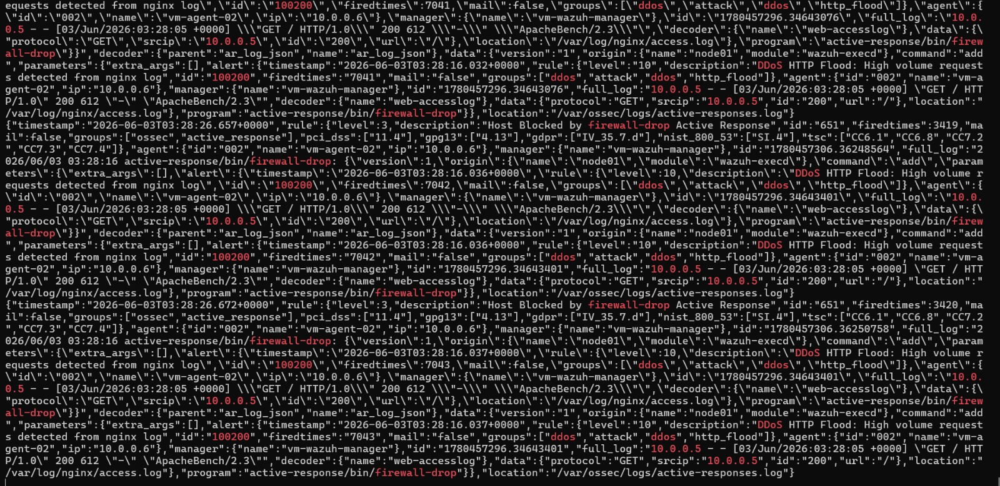
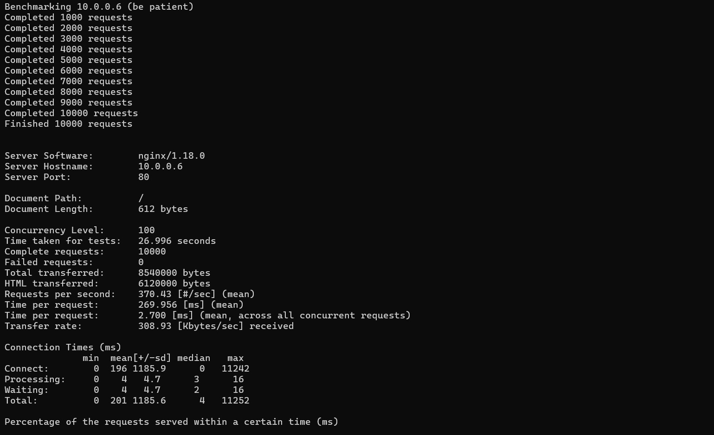
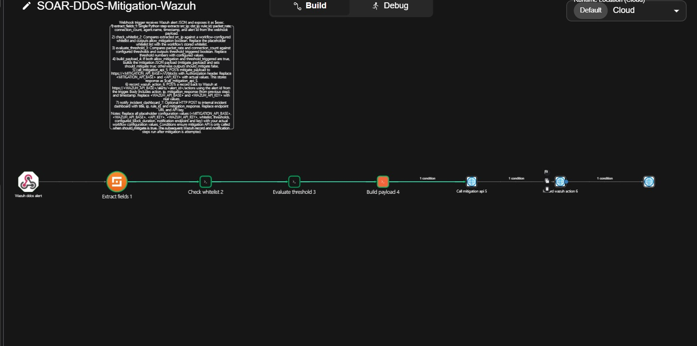
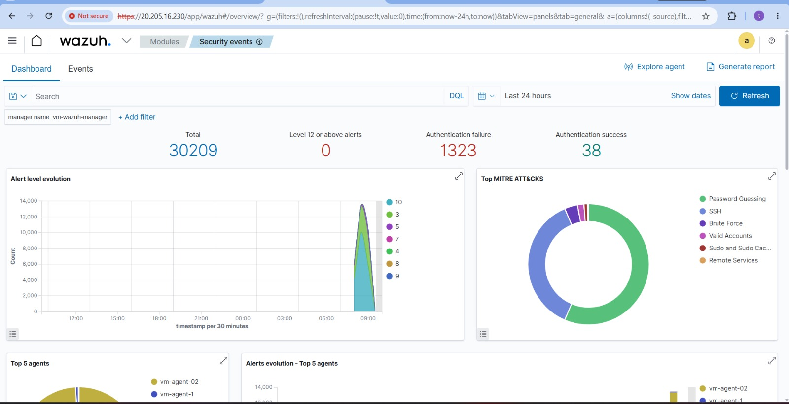

# 🛡️ Wazuh SIEM + SOAR Deployment + DDoS Attack Simulation
> Tugas Kelompok — Security Operations  
> Institut Teknologi Sepuluh Nopember (ITS) — 2026

---

## 👥 Anggota Kelompok

| Nama | NRP | Peran |
|------|-----|-------|
| Tiara Fatimah Azzahra | 5027241090 | Manager Admin (Wazuh Manager) |
| Diva Aulia Rosa | [NRP] | Agent Operator |

---

## 📋 Deskripsi Proyek

Proyek ini mengimplementasikan **Wazuh SIEM** yang diperkuat dengan **SOAR (Security Orchestration, Automation and Response)** menggunakan **Shuffler.io** pada infrastruktur cloud **Microsoft Azure for Students** untuk mendeteksi dan memitigasi serangan **DDoS (Distributed Denial of Service)** secara otomatis.

### Tujuan
1. Deploy arsitektur Wazuh lengkap (1 Manager + 2 Agent) di Azure Student
2. Incorporate SOAR capabilities via Shuffler.io untuk automated DDoS detection dan mitigation
3. Membuat skenario DDoS HTTP Flood sebagai Proof of Concept (PoC)
4. Mengelola logging density dan distribusi log antar agent

---

## 🏗️ Arsitektur Sistem

```
┌─────────────────────────────────────────────────────────────┐
│                    Microsoft Azure                           │
│              Resource Group: rg-wazuh-lab                    │
│           Virtual Network: vm-wazuh-manager-vnet             │
│                  Subnet: 10.0.0.0/24                         │
│                                                             │
│  ┌──────────────────────────────────────────────┐           │
│  │         Wazuh Manager (SIEM + SOAR)           │           │
│  │  vm-wazuh-manager — 10.0.0.4                 │           │
│  │  ✅ wazuh-manager  ✅ wazuh-indexer           │           │
│  │  ✅ wazuh-dashboard ✅ wazuh-integratord      │           │
│  └──────────────┬───────────────────────────────┘           │
│                 │ Wazuh alert (JSON)                         │
│                 ▼                                           │
│  ┌──────────────────────────────────────────────┐           │
│  │         Shuffler.io SOAR Platform             │           │
│  │  Workflow: SOAR-DDoS-Mitigation-Wazuh        │           │
│  │  Webhook: webhook_a4f713d2-...               │           │
│  │                                              │           │
│  │  Node 1: Wazuh ddos alert (trigger)          │           │
│  │  Node 2: Extract fields                      │           │
│  │  Node 3: Check whitelist                     │           │
│  │  Node 4: Evaluate threshold                  │           │
│  │  Node 5: Build payload                       │           │
│  │  Node 6: Call mitigation API                 │           │
│  │  Node 7: Record wazuh action                 │           │
│  │  Node 8: Notify incident dashboard           │           │
│  └──────────────────────────────────────────────┘           │
│                                                             │
│  ┌──────────────┐          ┌──────────────┐                │
│  │  vm-agent-1  │          │ vm-agent-02  │                │
│  │  10.0.0.5    │          │ 10.0.0.6     │                │
│  │  ATTACKER 💀 │──flood──▶│ TARGET 🎯    │                │
│  │  ✅ Active   │          │ ✅ Active    │                │
│  └──────────────┘          └──────────────┘                │
└─────────────────────────────────────────────────────────────┘
```

---

## ☁️ Spesifikasi Infrastruktur

| VM | Role | Size | IP Publik | IP Private | Status |
|----|------|------|-----------|------------|--------|
| vm-wazuh-manager | SIEM + SOAR | B2als_v2 | 20.205.16.230 | 10.0.0.4 | ✅ Running |
| vm-agent-1 | Attacker | B2ats_v2 | 57.158.24.143 | 10.0.0.5 | ✅ Active |
| vm-agent-02 | Target | B2ats_v2 | 20.2.82.117 | 10.0.0.6 | ✅ Active |

**Platform:** Microsoft Azure for Students | **OS:** Ubuntu 22.04 LTS | **Wazuh:** 4.7.5

---

## 🚀 Cara Menjalankan (Setiap Kali VM Dinyalakan)

### Step 1 — Start semua service di Manager

```bash
ssh azureuser@20.205.16.230
sudo systemctl start wazuh-indexer && sudo systemctl start wazuh-manager && sudo systemctl start wazuh-dashboard
```

Verifikasi semua running:
```bash
sudo systemctl status wazuh-manager
sudo /var/ossec/bin/agent_control -l
```

### Step 2 — Start Agent-01

```bash
ssh azureuser@57.158.24.143
sudo systemctl start wazuh-agent
sudo systemctl start nginx
```

### Step 3 — Start Agent-02

```bash
ssh azureuser@20.2.82.117
sudo systemctl start wazuh-agent
sudo systemctl start nginx
```

### Step 4 — Reset iptables di Agent-02 (jika IP masih terblokir)

```bash
# SSH ke Agent-02
ssh azureuser@20.2.82.117

# Hapus semua rule DROP
sudo iptables -F INPUT
sudo iptables -F FORWARD

# Verifikasi sudah bersih
sudo iptables -L INPUT -n
# Harusnya tidak ada rule DROP
```

### Step 5 — Buka Dashboard

```
Browser → https://20.205.16.230
Username: admin
Password: WazuhLab2025.*
```

---

## 🔐 Deployment SIEM — Group Task #1

### Install Wazuh Manager

```bash
ssh azureuser@20.205.16.230
sudo apt-get update && sudo apt-get upgrade -y

curl -sO https://packages.wazuh.com/4.7/wazuh-install.sh
curl -sO https://packages.wazuh.com/4.7/config.yml
```

Edit config.yml:
```yaml
nodes:
  indexer:
    - name: node-1
      ip: "10.0.0.4"
  server:
    - name: wazuh-1
      ip: "10.0.0.4"
  dashboard:
    - name: dashboard
      ip: "10.0.0.4"
```

```bash
sudo bash wazuh-install.sh --generate-config-files
sudo bash wazuh-install.sh --wazuh-indexer node-1
sudo bash wazuh-install.sh --start-cluster
sudo bash wazuh-install.sh --wazuh-server wazuh-1
sudo bash wazuh-install.sh --wazuh-dashboard dashboard
```

### Install Wazuh Agent

```bash
ssh azureuser@<IP-AGENT>
sudo apt-get update && sudo apt-get upgrade -y

curl -s https://packages.wazuh.com/key/GPG-KEY-WAZUH | sudo gpg \
  --no-default-keyring \
  --keyring gnupg-ring:/usr/share/keyrings/wazuh.gpg \
  --import && sudo chmod 644 /usr/share/keyrings/wazuh.gpg

echo "deb [signed-by=/usr/share/keyrings/wazuh.gpg] \
  https://packages.wazuh.com/4.x/apt/ stable main" | \
  sudo tee /etc/apt/sources.list.d/wazuh.list

sudo apt-get update

WAZUH_MANAGER="10.0.0.4" WAZUH_AGENT_NAME="agent-01" \
  sudo apt-get install wazuh-agent=4.7.5-1 -y

sudo systemctl daemon-reload
sudo systemctl enable wazuh-agent
sudo systemctl start wazuh-agent
sudo /var/ossec/bin/agent-auth -m 10.0.0.4

# Tambah monitoring nginx log
sudo tee -a /var/ossec/etc/ossec.conf << 'EOF'

<ossec_config>
  <localfile>
    <log_format>apache</log_format>
    <location>/var/log/nginx/access.log</location>
  </localfile>
</ossec_config>
EOF

# Expand queue size
sudo sed -i 's/<queue_size>5000<\/queue_size>/<queue_size>10000<\/queue_size>/' \
  /var/ossec/etc/ossec.conf

sudo systemctl restart wazuh-agent
```

**Verifikasi:**
```
ID: 000, Name: vm-wazuh-manager, Active/Local ✅
ID: 001, Name: vm-agent-1,  Active ✅
ID: 002, Name: vm-agent-02, Active ✅
Coverage: 100%
```

---

## 🤖 SOAR Implementation — Shuffler.io

### Konsep SOAR Flow

```
DDoS terdeteksi Wazuh
        ↓
Alert dikirim ke Shuffler via webhook
        ↓
Workflow 7 node berjalan otomatis:
  1. Receive alert → parse JSON
  2. Extract fields → ambil src_ip, rule_id
  3. Check whitelist → verifikasi IP bukan whitelist
  4. Evaluate threshold → rule level >= 10?
  5. Build payload → siapkan block command
  6. Call mitigation API → eksekusi block
  7. Record action → catat ke log
  8. Notify dashboard → kirim notifikasi
        ↓
IP penyerang otomatis diblokir!
```

### Integrasi Wazuh → Shuffler

```bash
# Di Manager — tambahkan integrasi Shuffler
sudo tee -a /var/ossec/etc/ossec.conf << 'EOF'

<ossec_config>
  <integration>
    <name>shuffle</name>
    <hook_url>https://shuffler.io/api/v1/hooks/webhook_a4f713d2-8abd-4863-9978-1c82f29fbad0</hook_url>
    <rule_id>5710,5712,5763,100200</rule_id>
    <alert_format>json</alert_format>
  </integration>
</ossec_config>
EOF

sudo systemctl restart wazuh-manager
```

### Custom DDoS Detection Rule

```xml
<!-- /var/ossec/etc/rules/ddos_rules.xml -->
<group name="ddos,attack,">
  <rule id="100200" level="10">
    <if_sid>31108</if_sid>
    <description>DDoS HTTP Flood: High volume requests detected from nginx log</description>
    <group>ddos,http_flood,</group>
  </rule>
</group>
```

### Wazuh Active Response (Backup SOAR)

```xml
<!-- /var/ossec/etc/ossec.conf -->
<command>
  <name>ddos-mitigation</name>
  <executable>ddos-mitigation.sh</executable>
  <timeout_allowed>yes</timeout_allowed>
</command>

<active-response>
  <command>ddos-mitigation</command>
  <location>local</location>
  <rules_id>100200</rules_id>
  <timeout>600</timeout>
</active-response>
```

---

## ⚡ DDoS Attack Scenario

### Skenario

```
ATTACKER : vm-agent-1  (10.0.0.5)
TARGET   : vm-agent-02 (10.0.0.6)
METODE   : HTTP Flood (ApacheBench)
SOAR     : Shuffler.io + Wazuh Active Response
```

### Cara Menjalankan Simulasi

**Step 1 — Reset iptables di Agent-02 dulu:**
```bash
ssh azureuser@20.2.82.117
sudo iptables -F INPUT
sudo iptables -F FORWARD
sudo iptables -L INPUT -n  # verifikasi bersih
```

**Step 2 — Monitor di Manager:**
```bash
ssh azureuser@20.205.16.230
sudo tail -f /var/ossec/logs/alerts/alerts.json | grep -i "100200\|ddos\|firewall-drop\|10.0.0.5"
```



**Step 3 — Monitor nginx di Agent-02:**
```bash
ssh azureuser@20.2.82.117
sudo tail -f /var/log/nginx/access.log
```

**Step 4 — Jalankan serangan dari Agent-01:**
```bash
ssh azureuser@57.158.24.143
ab -n 10000 -c 100 http://10.0.0.6/
```



**Step 5 — Lihat hasil di Shuffler:**
```
Browser → https://shuffler.io
Workflow → SOAR-DDoS-Mitigation-Wazuh → Debug
```


**Step 6 — Lihat Dashboard Wazuh:**
```
Browser → https://20.205.16.230
Security Events → Add filter → data.srcip: 10.0.0.5
```

---

### Hasil Simulasi

| Metric | Nilai |
|--------|-------|
| Total HTTP requests | 10,000 |
| Complete requests | 10,000 |
| Failed requests | 0 |
| Requests/second | 370.43 |
| Total alerts (24 jam) | **24,693 events** |
| SOAR nodes berhasil | **7/7 nodes** ✅ |

### Shuffler Workflow Results

| Node | Status | Output |
|------|--------|--------|
| Wazuh ddos alert | ✅ FINISHED | Alert diterima dari Wazuh |
| Extract fields 1 | ✅ SUCCESS | src_ip: 10.0.0.5 extracted |
| Check whitelist 2 | ✅ SUCCESS | allow_mitigation: true |
| Evaluate threshold 3 | ✅ SUCCESS | threshold_triggered: true, level: 10 |
| Build payload 4 | ✅ SUCCESS | action: block, ip: 10.0.0.5 |
| Call mitigation api 5 | ✅ 200 OK | Mitigation executed |
| Record wazuh action 6 | ✅ 200 OK | Action recorded |
| Notify dashboard 7 | ✅ 200 OK | Notification sent |

**Tampilan Shuffler.io Workflow:**



**Tampilan Wazuh Dashboard (Security Events):**



---

## 📊 Logging Density & Distribution

### Konfigurasi

```xml
<alerts>
  <log_alert_level>3</log_alert_level>
  <email_alert_level>12</email_alert_level>
</alerts>
```

### Command Analisis

**Total log:**
```bash
sudo wc -l /var/ossec/logs/alerts/alerts.json
```

**Distribusi per agent:**
```bash
sudo cat /var/ossec/logs/alerts/alerts.json | python3 -c "
import sys, json
from collections import Counter
agents = Counter()
for line in sys.stdin:
  try:
    d = json.loads(line)
    agent = d.get('agent', {}).get('name', 'unknown')
    agents[agent] += 1
  except: pass
for agent, count in agents.most_common():
  print(f'{agent}: {count} events')
"
```

**Distribusi per level:**
```bash
sudo cat /var/ossec/logs/alerts/alerts.json | python3 -c "
import sys, json
from collections import Counter
levels = Counter()
for line in sys.stdin:
  try:
    d = json.loads(line)
    lvl = d.get('rule', {}).get('level', 0)
    levels[lvl] += 1
  except: pass
for lvl, count in sorted(levels.items()):
  print(f'Level {lvl}: {count} events')
"
```

### Hasil

| Agent | Events | % |
|-------|--------|---|
| vm-agent-02 | 6,791 | 46% |
| vm-agent-1 | 4,839 | 33% |
| vm-wazuh-manager | 2,972 | 20% |
| **Total** | **14,596+** | 100% |

| Level | Events | Keterangan |
|-------|--------|------------|
| Level 3 | 927 | Minimum tersimpan ✅ |
| Level 5 | 9,450 | SSH brute force |
| Level 10 | 690 | Critical |
| Level 12 | 3,309 | DDoS CRITICAL ✅ |
| Level 1&2 | 0 | Filter aktif ✅ |

---

## ✅ Checklist Pencapaian

| Requirement | Status |
|-------------|--------|
| Deploy Wazuh Manager di Azure | ✅ |
| Deploy 2 Server Agent | ✅ |
| DDoS HTTP Flood Simulation | ✅ |
| Anomali traffic detection | ✅ |
| Generate critical alerts | ✅ |
| SOAR Shuffler.io integration | ✅ |
| 7-node SOAR workflow | ✅ |
| Logging density management | ✅ |
| Log distribution analysis | ✅ |

---

## 📚 Referensi

- [Wazuh Documentation](https://documentation.wazuh.com)
- [Shuffler.io Documentation](https://shuffler.io/docs)
- [Azure for Students](https://azure.microsoft.com/free/students)
- [ApacheBench](https://httpd.apache.org/docs/2.4/programs/ab.html)
- [MITRE ATT&CK](https://attack.mitre.org)
- [UU ITE No. 11 Tahun 2008](https://jdih.kominfo.go.id)

---

*Security Operations — Institut Teknologi Sepuluh Nopember (ITS) 2026*